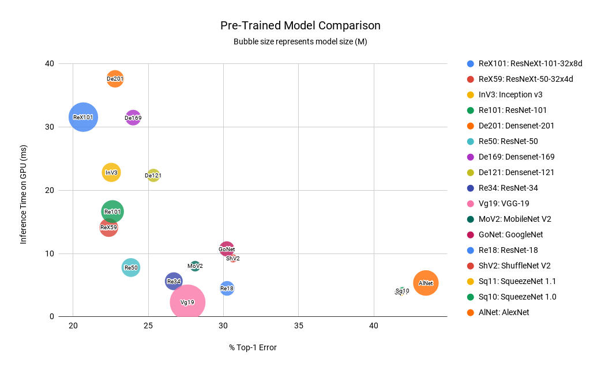
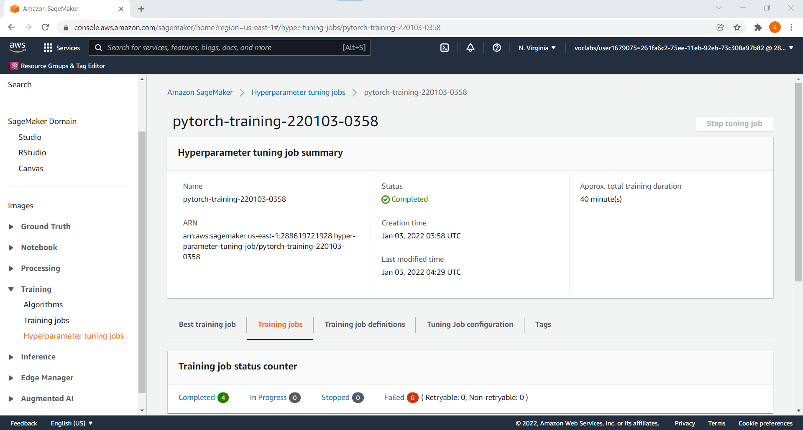
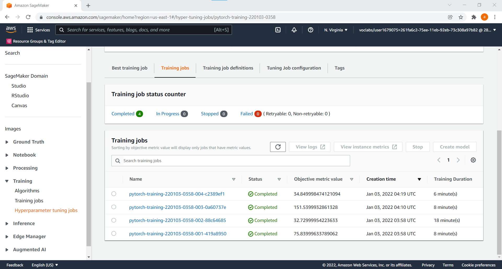
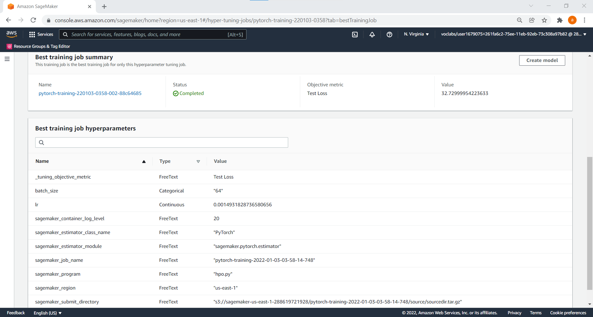
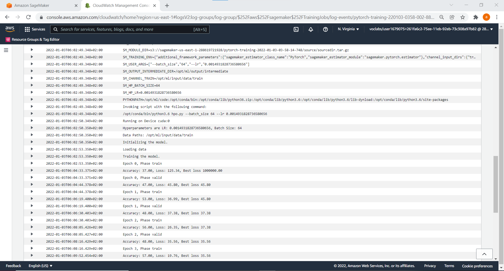
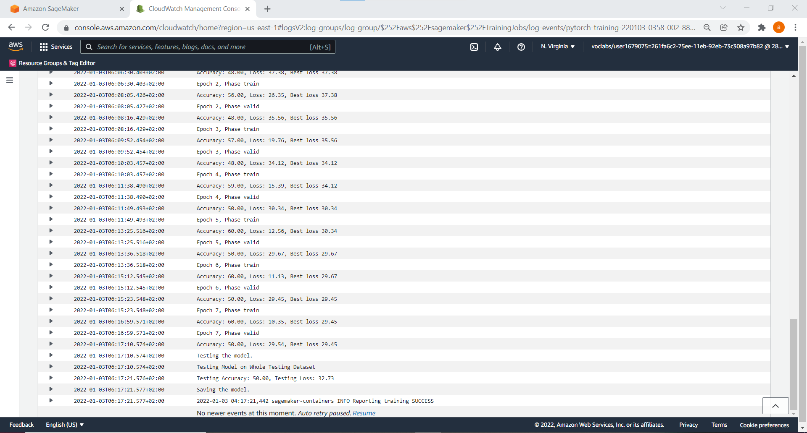
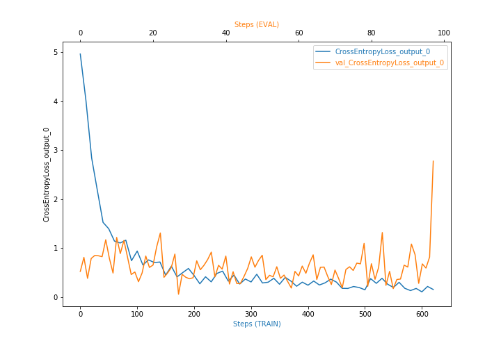
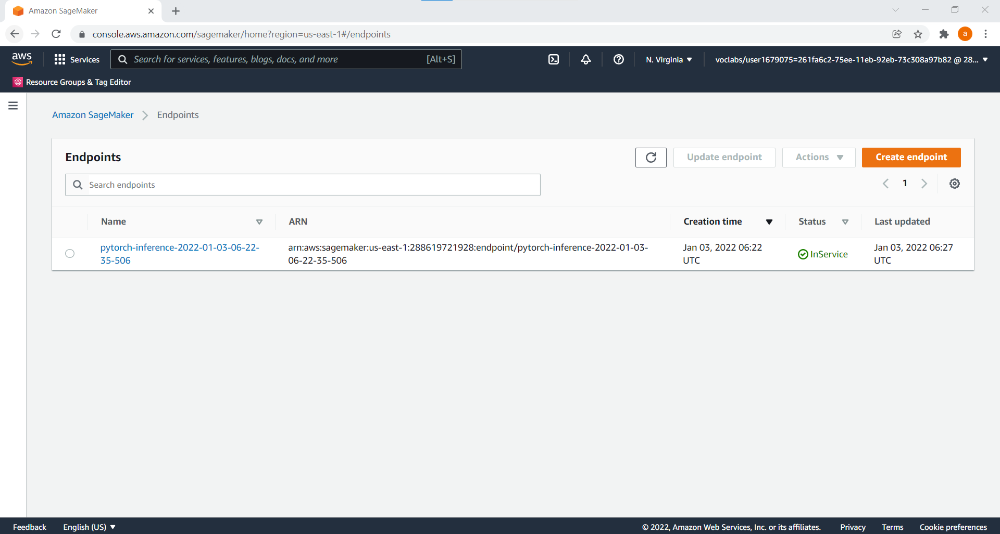
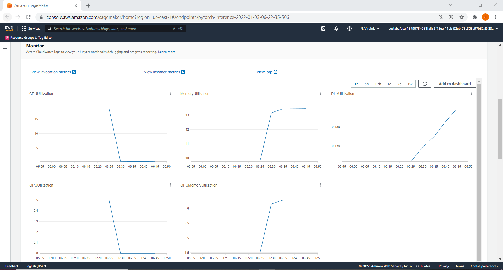

# Image Classification using AWS SageMaker

AWS Sagemaker was used to train a pre-trained model that can perform image classification by using the Sagemaker profiling, debugger, hyperparameter tuning and other good ML engineering practices.

## Project Set Up and Installation
Enter AWS through the gateway in the course and open SageMaker Studio. 
Download the starter files.
Download/Make the dataset available.

## Dataset
The dog breed classification dataset [1] was used. It contains images from 133 dog breeds divided into training, testing and validation datasets [4].

### Access
Upload the data to an S3 bucket through the AWS Gateway so that SageMaker has access to the data. 

## Script files 

'hpo.py' was used for hyperparameter tuning. Different hyperparameters were used to train the  model to find the best hyperparameters, which gave the lowest loss for the model.  

'train_model.py' was used to train the model with the best hyperparameters and perform debugging and profiling.  

'infernce2.py' was used to deploy the trained model to an endpoint. The image was deserialized, processed (resized, converted to a tensor, normalized and unsqueezed) and used to make a prediction.  


## Hyperparameter Tuning
What kind of model did you choose for this experiment and why? Give an overview of the types of parameters and their ranges used for the hyperparameter search.

Remember that your README should:
- Include a screenshot of completed training jobs
- Logs metrics during the training process
- Tune at least two hyperparameters
- Retrieve the best hyperparameters from all your training jobs


The ResNet50 model [2] was used because it has the best accuracy and speed, and a small model size when compared to other models [3] as shown in the figure below from [3].



The script file ('hpo.py') was used for hyperparameter tuning. The batch size and learning rate hyperparameters of the ResNet50 pre-trained model were tuned. The hyperparameters ranges chosen are widely used in tuning. The following hyperparameter ranges were used:

<code>Learning rate: 0.001 to 0.1
 Batch size: [32, 64, 128, 256]
</code>
    
The hyperparameter tuning job summary is shown below.



The training jobs are shown below.



The best training job is shown below.



The best hyperparameters found by the tuning job are:

<code>Learning rate: 0.0014931828736580656
 Batch size: 64
</code>


  

A subset of the logs for the best training job is shown below.




## Debugging and Profiling
**TODO**: Give an overview of how you performed model debugging and profiling in Sagemaker

Configurations rules for the debugger and profiler were setup in the notebook. These were passed as parameters when the estimator was made. Hooks were setup in the script file ('train_model.py') to record statistics.

### Results
**TODO**: What are the results/insights did you get by profiling/debugging your model?

**TODO** Remember to provide the profiler html/pdf file in your submission.

The report provides a summary of the training job, system resource usage statistics, framework metrics, rules summary, and detailed analysis from each rule. The report showed the following insights (among others):

- GPU utilization analysis: The training job was underutilizing the instance. It recommended either switching to a smaller instance type or increasing the batch size.

- CPU bottlenecks: 757 CPU bottlenecks (50% of the total time) were found.

- GPU Memory utilization: Memory utilization on gpu0 fluctuates often.

The cross entropy loss for training and validation is shown below.



The training loss curve decreases as the number of steps increases, which may be a good fit. However, the validation loss shows noisy movements around the training loss. This may indicate an unrepresentative validation dataset that does not provide enough information to evaluate the model's ability to generalize. This may occur if the validation dataset is too small as compared to the training dataset [5].

The spikes in the validation loss curve could be due to several reasons:

- A small batch size (The batch size is 64) [10]. A larger batch size may avoid this.

- The final batch in an epoch may be smaller than the batch size if the dataset is not divisible by the batch size. The number of training images is 6680 and the batch size is 64, 6680/64=104.4. A small batch size causes high variance. This may have been avoided by setting <code>drop_last=True</code> in the torch dataloader [11]. 

- Outliers in the dataset [11]. Removing outliers may avoid this.

**TODO**: Is there some anomalous behaviour in your debugging output? If so, what is the error and how will you fix it?
**TODO**: If not, suppose there was an error. What would that error look like and how would you have fixed it?

If the validation loss decreases to a point and then starts increasing, it may indicate overfitting [5]. This may be solved by training for less time, regularization, weight initialization, dropout regularization and weight constraints [6].
 


## Model Deployment

**TODO**: Give an overview of the deployed model and instructions on how to query the endpoint with a sample input.

**TODO** Remember to provide a screenshot of the deployed active endpoint in Sagemaker.

The model was deployed with one instance on a ml.g4dn.xlarge instance type. 

The inference script method from Lesson 5, Project 4 was used to load the model. The infernce2.py script was adapted as needed. 

The script consists of three functions [13]:

- <code>model_fn</code>: Loads the model. 

- <code>input_fn</code>: Deserializes the request data into an object for prediction.

- <code>predict_fn</code>: Performs prediction with the loaded model on the deserialized request object.

The script serves as an entry point script during inference [12]. The image was deserialized in the input_fn function.

```
if content_type == JPEG_CONTENT_TYPE: 
    return Image.open(io.BytesIO(request_body))
    
if content_type == JSON_CONTENT_TYPE:
    request = json.loads(request_body)  
    url = request['url']
    img_content = requests.get(url).content
    return Image.open(io.BytesIO(img_content))    
```

The image was processed in the predict_fn function. It was resized, converted to a tensor, normalized and unsqueezed) and used to make a prediction. 

```
test_transform = transforms.Compose([
    transforms.Resize((224, 224)),
    transforms.ToTensor(),
    transforms.Normalize(mean=[0.485, 0.456, 0.406], std=[0.229, 0.224, 0.225])
    ])  

normalized=test_transform(input_object)
batchified = normalized.unsqueeze(0)
input1 = batchified.to(device)
    
with torch.no_grad():
    prediction = model(input1)
    return prediction
```

The image was passed to the model to make a prediction in the notebook. An array of 133 dog breeds is returned. The maximum is the most likely dog breed.  

```
img_name = "Labrador_retriever_06470.jpg"
payload = None

with open(img_name, 'rb') as f:
    payload = f.read()

response = predictor.predict(data=payload, initial_args={"ContentType": "image/jpeg"})

```

The deployed active endpoint in Sagemaker is shown below.



The metrics for the endpoint are shown below.




## References

[1] https://s3-us-west-1.amazonaws.com/udacity-aind/dog-project/dogImages.zip , Accessed 11/12/21.

[2] He, K., Zhang, X., Ren, S. and Sun, J., 2016. Deep residual learning for image recognition. In Proceedings of the IEEE conference on computer vision and pattern recognition (pp. 770-778).

[3] https://learnopencv.com/pytorch-for-beginners-image-classification-using-pre-trained-models/ , Accessed 15/12/21.

[4] https://classroom.udacity.com/nanodegrees/nd189/parts/cd0387/modules/d0966867-c32b-4e96-ace8-99590700f02c/lessons/cc48aa55-2ef2-4cd1-8475-fec07e814d1a/concepts/2a147a62-97cf-4c0a-b998-d2916359297f , Accessed 15/12/21.
 
[5] https://machinelearningmastery.com/learning-curves-for-diagnosing-machine-learning-model-performance/ , Accessed 10/1/22.

[6] https://github.com/aws/amazon-sagemaker-examples/blob/master/sagemaker-debugger/pytorch_model_debugging/pytorch_script_change_smdebug.ipynb , Accessed 15/12/21.

[7] https://stackoverflow.com/questions/54833077/sagemaker-neo-pytorch-1-0-0 , Accessed 15/12/21.

[8] https://docs.aws.amazon.com/sagemaker/latest/dg/neo-troubleshooting-inference.html , Accessed 15/12/21.

[9] https://github.com/aws/amazon-sagemaker-examples/blob/master/advanced_functionality/fastai_oxford_pets/fastai_lesson1_sagemaker_example.ipynb , Accessed 15/12/21.

[10] https://stackoverflow.com/questions/68529287/why-does-my-learning-curves-shows-spikes-or-fluctuations , Accessed 10/1/22.

[11] https://stats.stackexchange.com/questions/303857/explanation-of-spikes-in-training-loss-vs-iterations-with-adam-optimizer ,  Accessed 10/1/22.

[12] https://docs.aws.amazon.com/sagemaker/latest/dg/neo-deployment-hosting-services-prerequisites.html,  Accessed 10/1/22.

[13] https://sagemaker.readthedocs.io/en/stable/frameworks/pytorch/using_pytorch.html#id3,  Accessed 10/1/22.


